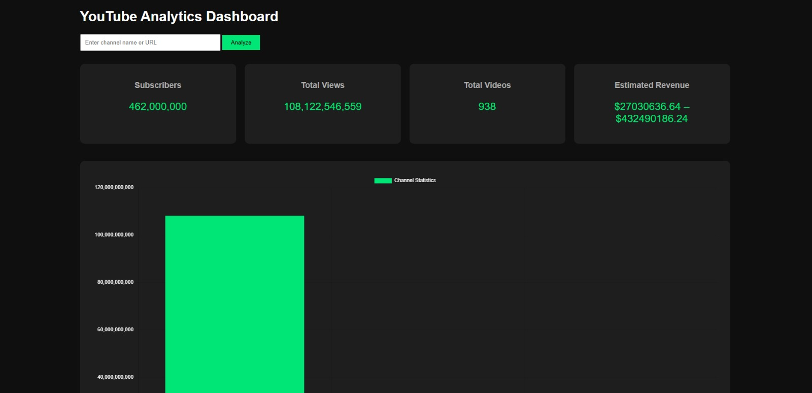

# YouTube Analytics Dashboard 📊

A Flask-based dashboard that allows users to enter any YouTube channel name or URL and instantly view key analytics like Subscribers, Total Views, Total Videos, Estimated Revenue, and visual charts.

## Features
- Search by Channel Name or URL
- Displays key channel statistics
- Graphical data visualization
- Simple and clean dashboard UI

## Tech Stack
- Python (Flask)
- HTML, CSS, JavaScript
- Chart Visualization

## Dashboard Preview

